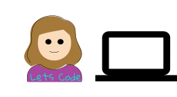

### Olá! 

 

### Me chamo Fernanda Kipper
- Estudante de graduação em Ciência da Computação.
- Amante do desenvolvimento web. 
- Atualmente estou trabalhando em projetos relacionados a minha bolsa de Desenvolvimento Tecnológico.
- Sempre em busca do conhecimento, aprendizado e experiências ✨

### Minhas principais habilidades são: 

-Javascript 
- HTML e CSS
- SQL
- Programaçao Orientada Objetos

<!--
**Fernanda-Kipper/Fernanda-Kipper** is a ✨ _special_ ✨ repository because its `README.md` (this file) appears on your GitHub profile.

Here are some ideas to get you started:

- 🔭 I’m currently working on ...
- 🌱 I’m currently learning ...
- 👯 I’m looking to collaborate on ...
- 🤔 I’m looking for help with ...
- 💬 Ask me about ...
- 📫 How to reach me: ...
- 😄 Pronouns: ...
- ⚡ Fun fact: ...
-->
