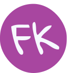

### Olá! 

 

### Me chamo Fernanda Kipper
- Estudante de graduação em Ciência da Computação.
- Amante do desenvolvimento web. 
- Atualmente estou trabalhando em projetos relacionados a minha bolsa de Desenvolvimento Tecnológico concedida pela FAPERGS, fazendo parte de um grupo de pesquisadores da universidade, [CrIE](http://crie.space/) 🔍
- Sempre em busca do conhecimento, aprendizado e experiências ✨

 

### Minhas principais skills são:
- HTML e CSS
- JavaScript (frameworks como: React JS)
- Node.js  (frameworks como: Express)
- SQL
- Typescript
- Programação Orientada Objetos

