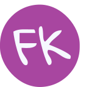

<h1>Hello!</h1>
 

  
 

## My name is Fernanda Kipper
- Computer Science Student
- Passionate about web development
- Frontend Tech Trainee at [Aftersale](https://after.sale/) (React JS | Next JS | Sass | JS | HTML | CSS | Typescript | Styled Components ) 🚀
- I work on projects related to my Technological Development scholarship granted by [FAPERGS](https://fapergs.rs.gov.br/inicial), belonging to a group of researchers at the university, [CrIE](http://crie.space/) 🔍 (React JS | JS | HTML | CSS | Typescript | NodeJS)
- Always thirst for learning, knowledge and experience ✨

## My Stack

  <h3>Most used Frameworks & Libs</h3>
  
  - React JS
  - Next JS
  - Styled Components
  - Sass
  - Express JS
  

